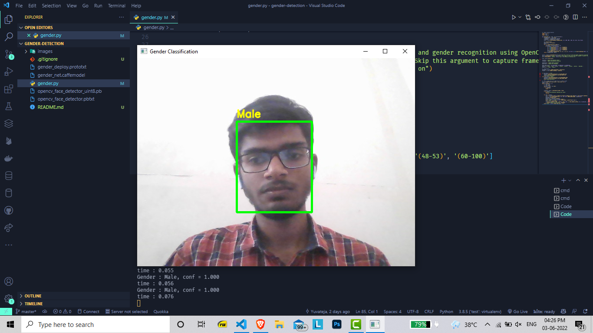

# SA-C-GENDER-CLASSIFIER
## Algorithm
1. import all the necessary libraries

2. Train with the image dataset
3. Predict with the test image
4. Display data on the image

## Program:
```python
"""
Program to implement 
Developed by   : MADITHATI YUVATEJA REDDY
RegisterNumber :  212219040069
"""
import cv2 as cv
import time
import argparse

def getFaceBox(net, frame, conf_threshold=0.7):
    frameOpencvDnn = frame.copy()
    frameHeight = frameOpencvDnn.shape[0]
    frameWidth = frameOpencvDnn.shape[1]
    blob = cv.dnn.blobFromImage(frameOpencvDnn, 1.0, (300, 300), [104, 117, 123], True, False)

    net.setInput(blob)
    detections = net.forward()
    bboxes = []
    for i in range(detections.shape[2]):
        confidence = detections[0, 0, i, 2]
        if confidence > conf_threshold:
            x1 = int(detections[0, 0, i, 3] * frameWidth)
            y1 = int(detections[0, 0, i, 4] * frameHeight)
            x2 = int(detections[0, 0, i, 5] * frameWidth)
            y2 = int(detections[0, 0, i, 6] * frameHeight)
            bboxes.append([x1, y1, x2, y2])
            cv.rectangle(frameOpencvDnn, (x1, y1), (x2, y2), (0, 255, 0), int(round(frameHeight/150)), 8)
    return frameOpencvDnn, bboxes


parser = argparse.ArgumentParser(description='Use this script to run age and gender recognition using OpenCV.')
parser.add_argument('--input', help='Path to input image or video file. Skip this argument to capture frames from a camera.')
parser.add_argument("--device", default="cpu", help="Device to inference on")

args = parser.parse_args()

faceProto = "opencv_face_detector.pbtxt"
faceModel = "opencv_face_detector_uint8.pb"

genderProto = "gender_deploy.prototxt"
genderModel = "gender_net.caffemodel"

MODEL_MEAN_VALUES = (78.4263377603, 87.7689143744, 114.895847746)
ageList = ['(0-2)', '(4-6)', '(8-12)', '(15-20)', '(25-32)', '(38-43)', '(48-53)', '(60-100)']
genderList = ['Male', 'Female']

genderNet = cv.dnn.readNet(genderModel, genderProto)
faceNet = cv.dnn.readNet(faceModel, faceProto)


if args.device == "cpu":
    genderNet.setPreferableBackend(cv.dnn.DNN_TARGET_CPU)
    faceNet.setPreferableBackend(cv.dnn.DNN_TARGET_CPU)
    print("Using CPU device")
elif args.device == "gpu":
    genderNet.setPreferableBackend(cv.dnn.DNN_BACKEND_CUDA)
    genderNet.setPreferableTarget(cv.dnn.DNN_TARGET_CUDA)
    print("Using GPU device")

cap = cv.VideoCapture(args.input if args.input else 0)
padding = 20
while cv.waitKey(1) < 0:
    t = time.time()
    hasFrame, frame = cap.read()
    if not hasFrame:
        cv.waitKey()
        break

    frameFace, bboxes = getFaceBox(faceNet, frame)
    if not bboxes:
        print("No face Detected, Checking next frame")
        continue

    for bbox in bboxes:
        face = frame[max(0,bbox[1]-padding):min(bbox[3]+padding,frame.shape[0]-1),max(0,bbox[0]-padding):min(bbox[2]+padding, frame.shape[1]-1)]
        blob = cv.dnn.blobFromImage(face, 1.0, (227, 227), MODEL_MEAN_VALUES, swapRB=False)
        genderNet.setInput(blob)
        genderPreds = genderNet.forward()
        gender = genderList[genderPreds[0].argmax()]
        print("Gender : {}, conf = {:.3f}".format(gender, genderPreds[0].max()))
        label = "{}".format(gender)
        cv.putText(frameFace, label, (bbox[0], bbox[1]-10), cv.FONT_HERSHEY_SIMPLEX, 0.8, (0,255,255), 2, cv.LINE_AA)
        cv.imshow("Gender Classification", frameFace)
    print("time : {:.3f}".format(time.time() - t))


```

## OUTPUT:

